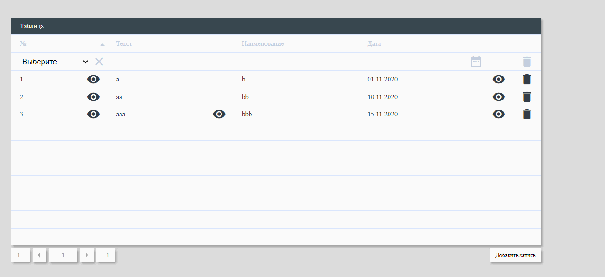

# React-Table component React



## Demo:

[https://asosunoff.github.io/React-Table/](https://asosunoff.github.io/React-Table/)

### Install component

```
npm i @asosunoff/react-table
```

### Launch project:

```
git clone https://github.com/aSosunoff/React-Table.git
cd React-Table
npm i
npm run start
```

### Test project:

```
npm test
```
